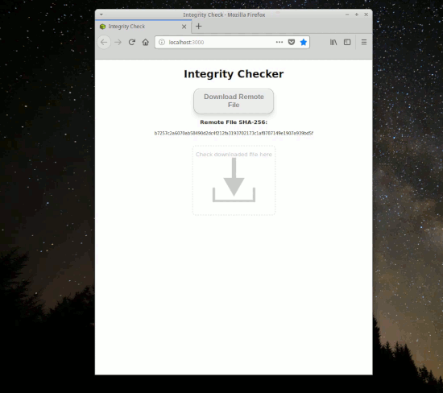

Name
----

SPA-SHA256

Description
-----------





A SPA that performs SHA-256 hash and check files using https://github.com/herreriasjose/react-drag-drop-info


You can see it <a href="https://spa-sha256-d892f.firebaseapp.com/">in action here</a>.
 

Installation
------------

You have to clone or download this repository.

Usage
-----

```bash
npm install
npm start
```

Testing
-------

This project uses Jest for testing.
Visit https://jestjs.io/ for details.

To execute tests: 

```bash
npm test
```
